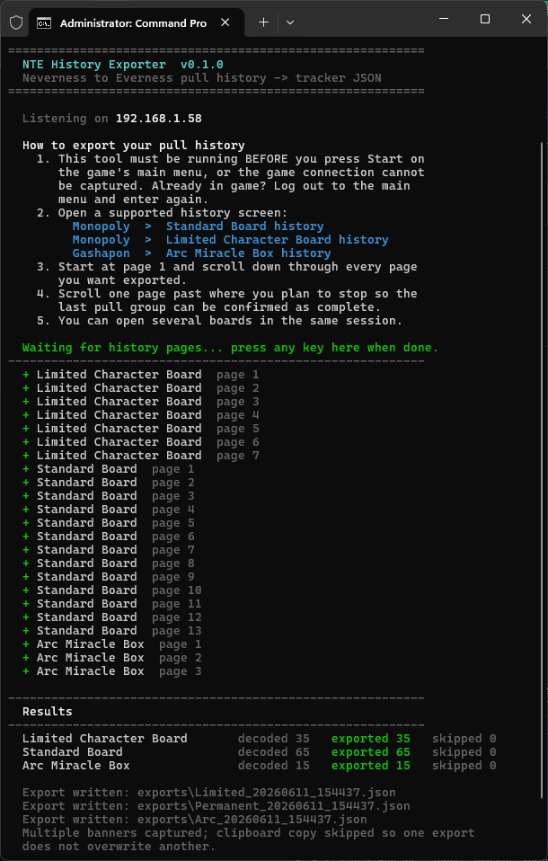

<div align="center">


# NTE History Exporter

Prototype CLI exporter for **Neverness to Everness** pull history — decodes your own game traffic into sanitized JSON ready for tracker import.


</div>

## Supported Banners

| System   | Banner                  | Banner ID                  | Pity pool  |
| -------- | ----------------------- | -------------------------- | ---------- |
| Monopoly | Standard Board          | `Lottery_Permanent`        | Per-banner |
| Monopoly | Limited Character Board | `Lottery_LimitedCharacter` | Shared     |
| Gashapon | Arc Miracle Box         | `Arc_MiracleBox`           | Shared     |

## What It Does

The exporter decodes Permanent Board, Limited Character Board, and Arc Miracle Box history pages from captured UDP data, applies conservative timestamp-boundary handling, and writes sanitized JSON suitable for tracker import.

> [!NOTE]
> The import JSON contains decoded history rows and the shareable NTE user UID when it can be detected. It does **not** export tokens, account IDs, role IDs, device IDs, server IPs, raw packets, cookies, session data, or other capture metadata.

## Requirements

- Python 3.10 or newer when running from source. Release binaries include the Python runtime.
- Packet-capture permission. On Windows, Npcap can usually capture without running this tool as Administrator; the raw-socket fallback may need Administrator. On Linux and macOS, use root or capture capabilities as required by your system.
- **Windows:** [Npcap](https://npcap.com/) is recommended. Install it normally; WinPcap API-compatible mode is not required. If Npcap is unavailable or cannot be initialized, `auto` falls back to the Windows built-in raw-socket backend.
- **Linux:** install the system **libpcap** runtime if it is not already present. Package names commonly include `libpcap0.8` on Debian/Ubuntu and `libpcap` on Fedora, Arch, and similar distributions.
- **macOS:** the system normally includes **libpcap**, so no separate Npcap installation is needed.

Npcap is Windows-only and is not bundled with this project. Linux and macOS use libpcap, the cross-platform capture library on which Npcap is based.

## Downloads

Compiled command-line builds are published on the [GitHub Releases page](https://github.com/Golumpa/nte-exporter/releases):

- `nte-history-exporter.exe` for Windows
- `nte-history-exporter-linux` for Linux
- `nte-history-exporter-macos` for macOS
- Versioned `.zip` archives for each platform

The Windows executable is a single console app. Start it from a terminal:

```powershell
.\nte-history-exporter.exe
```

On Linux and macOS, make the downloaded binary executable before running it. Use `sudo` only when your system requires elevated capture permission:

```bash
chmod +x ./nte-history-exporter-linux
sudo ./nte-history-exporter-linux
```

Use `nte-history-exporter-macos` in the same way on macOS. If your browser or OS blocks a downloaded macOS binary, allow it from the system security prompt before running it again.

## Usage

### Live capture

The default `auto` capture backend uses:

- **Windows:** Npcap when installed, with automatic fallback to the built-in Windows raw-socket backend.
- **Linux/macOS:** the system libpcap library.

Use `--capture-backend libpcap` to require Npcap/libpcap without fallback, or `--capture-backend raw` to require the Windows raw-socket backend.

#### Windows

Downloaded executable:

```powershell
.\nte-history-exporter.exe
```

From source:

```powershell
.\run-exporter.ps1
```

Or simply double-click **`run-exporter.cmd`**.

> [!IMPORTANT]
> For automatic user UID detection, launch the tool **before pressing Start on the game's main menu**. If you are already in game, history capture can still work; the tool will ask for your UID before saving if it cannot detect it automatically.

Once running, open any supported history board in game. The tool keeps listening until you press any key. Exports are written under `exports\` as:

- `<user_uid>_Permanent_<date_time>.json`
- `<user_uid>_Limited_<date_time>.json`
- `<user_uid>_Arc_<date_time>.json`

If the user UID is not detected automatically, the console asks for it before saving. Leaving it blank saves as `unknown_<banner>_<date_time>.json`, but may prevent import on some trackers.

Exports are not copied to the clipboard by default. Add `--copy-clipboard` to copy a single captured banner's JSON after saving. If multiple banners are captured in the same run, clipboard copy is skipped so one banner does not overwrite another.

If a page response is missed, the exporter reports the missing page number while capture is still running. Leave the exporter open, close and reopen that history board, then scroll down again. Scrolling backward within the existing view does not request the cached pages again. The replacement capture is accepted and the tool confirms when the gap has been recovered. If reopening the board still produces no page messages, return to the main menu and re-enter the game to start a fresh connection.

#### Linux/macOS

Downloaded executable, using `sudo` when your system requires elevated capture permission:

```bash
chmod +x ./nte-history-exporter-linux
sudo ./nte-history-exporter-linux
```

From source, install the project and ensure the system libpcap runtime is available:

```bash
python3 -m venv .venv
source .venv/bin/activate
python -m pip install -e .
sudo .venv/bin/nte-history-exporter
```

macOS normally includes libpcap. On Linux, install the distribution's libpcap runtime package if it is not already present. Capture can also be granted through platform-specific capabilities instead of running the whole exporter with `sudo`.

### File replay

Downloaded executable:

```powershell
.\nte-history-exporter.exe capture.flows
```

From source:

```powershell
.\run-exporter.ps1 capture.flows
```

Decodes a `mitmproxy .flows` capture instead of listening live — used for research and testing.

### Options

| Flag      | Effect                                              |
| --------- | --------------------------------------------------- |
| `--live`  | Capture live UDP traffic instead of reading a file. |
| `--debug` | Also write the full research CSV next to each JSON. |
| `--user-uid <uid>` | Override the auto-detected NTE user UID in the JSON export. |
| `--copy-clipboard` | Copy a single live export JSON to clipboard after saving. |

Advanced live-capture selection:

```text
--capture-backend auto      Prefer Npcap/libpcap; fall back to raw sockets on Windows
--capture-backend libpcap   Require Npcap on Windows or libpcap on Linux/macOS
--capture-backend raw       Require the Windows raw-socket backend
```

The `--debug` CSV holds any extra information that might be needed for fixing bugs. It contains no dangerous personal account data — only the raw bytes of the captured history page.

The exporter automatically includes the shareable NTE user UID when it appears in the capture. If a short capture does not include it, the console asks before saving; you can also pass it explicitly with `--user-uid`.

> [!TIP]
> For reliable deduplication, start from page 1 and scroll through the pages. If you only want pages 1–5, scroll through to page 6 as well just to be on the safe side.

## Privacy

> [!CAUTION]
> Sanitized exports are intended for tracker import and should not contain anything especially harmful, but they can identify the game account via user UID and pull history. Share exports only with verified sources, such as known trackers. Do not commit packet captures, generated exports, research briefs, or personal account data. The repository keeps `exports/` as an empty output folder but ignores everything generated inside it.

## Boundary Policy

NTE history records do not appear to contain a unique server-side roll ID. UIDs are generated from decoded record fields and the record's order within all rows sharing the same raw timestamp.

History always loads page 1 first and is scrolled downward, so the exporter anchors to the continuous run of pages starting at page 1 and ignores anything after the first gap (with a warning). This keeps the newest pages even if a later page is lost, and guarantees the newest timestamp group's ordinal 0 is captured.

Within a timestamp group, ordinal 0 is the newest record and unseen rows can only append after the captured ones, so **every exported UID is stable** — including a partially captured oldest 10-pull. All decoded rows are therefore exported. Re-scanning later simply adds any rows that were not yet captured, with the same UIDs for the rows already seen.

For Monopoly, Points Gift and Chase Reward rows stay in the timestamp group for UID ordinal generation, but only `result_type = dice` rows count toward pull-set sizing. Arc pulls are always 10-pulls. In both systems every captured group is exported, including the oldest one even if it is a partially captured pull set, because its captured prefix is ordinal-stable.

## Adapters

**Current**

- Live Npcap/libpcap capture on Windows, Linux, and macOS
- Live Windows raw-socket fallback
- `mitmproxy .flows` research decoder

**Planned**

- Optional pktmon diagnostics for capture-drop investigation
- UI wrapper around the CLI

## Example Run

<div align="center">
  
</div>
